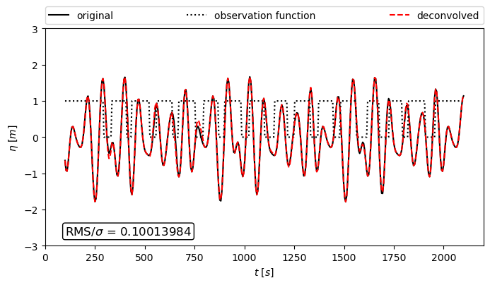

# Deconvolution

The deconvolution is a method to fill gaps in data, here implemented for the case of 1D.The deconvolution makes use of the convolution theorem and missing information is recovered in the frequency domain.

The method requires two vectors of the same length: 
- the data with gaps
- a marker for the gaps consisting of zeros (for gaps) and ones (otherwise)

Furthermore, the method requires a lower and an upper bound (w1 and w2) where the energy of the original data can be expected. In the case of a time series w1 and w2 define the frequency band of the original data. 

# Background and examples
Detailed information on the method is provided in 
"The deconvolution as a method to deal with gaps in ocean wave measurements" (Susanne Støle-Hentschel, José Carlos Nieto Borge, Karsten Trulsen)

https://www.sciencedirect.com/science/article/pii/S0029801820312804

# Usage 
Use the command for executing an example

python deconvolution.py

It generates a random wave. The wave is multiplied with the observation function that marks the gaps, hence gaps in the wave are replaced by zeros. The deconvolution is then applied to reconstruct the original values in the gaps. 

