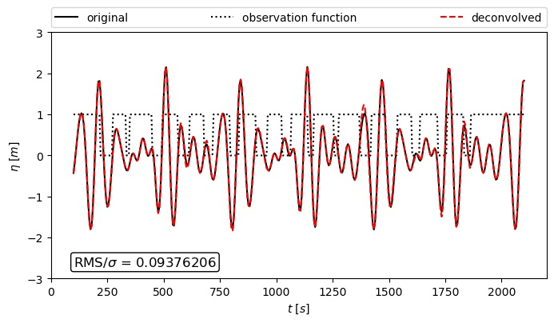
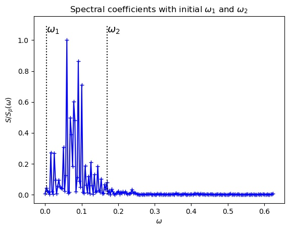

# Gap Filling by Deconvolution

This module fills gaps in measurements of waves and wave-like signals. The implementation is available for 1D. The technique applies the convolution theorem and missing information is recovered in the frequency domain. The algorithm is thus a deconvolution. 

The method requires two vectors of the same length: 
- the data with gaps 
- a marker for the gaps consisting of zeros (for gaps) and ones (otherwise)

# Example



The example shows the original signal that should be reconstructed. To generate gaps in the data series, the original was multiplied by the observation function. The deconvolution was then employed and the deconvoled signal is displayed.


# Background 
Detailed information on the method is provided in 
"The deconvolution as a method to deal with gaps in ocean wave measurements" (Susanne Støle-Hentschel, José Carlos Nieto Borge, Karsten Trulsen)

https://www.sciencedirect.com/science/article/pii/S0029801820312804

# Band limitation
The method works better for larger gaps when a lower and an upper bound (w1 and w2) are set. These boundaries define the frequency band where the energy of the original signal can be expected. If the original signal is well represented by a rather narrow band, the gap filling works well for gap sizes up to half the peak Period, possibly larger. If the the energy in the original signal is spread up to high frequencies, recovery is with this method is limited. By using the Deconvolution Framework, the parameters for w1 and w2 are set to initial values and plotted. As below




# Implementation:

There are two options to apply the deconvolution:

## 1. Gap Filling Framework
The framework enables the user to feed a large dataset. This is then deconvolved on subintervals. The number of intervals can be provided to the framework. The framework automatically calculates a band limitation for which the deconvolution can be conducted. This band limitation should preferably be adapted.
    
## 2. Gap Filling Core
The Deconvolution core contains the core of the deconvolution algorithm and can be used directly. It deconvolves the provided data in one step and requires the definition of w1 and w2 as boundaries for the non-zero frequency band [w1;w2].

# Examples:

## Creation of data (eta) :
```python
    # define wave
    N = 400 
    N_modes = 20
    b = 0.775
    phi = np.random.uniform(0,2*np.pi, N_modes)
    t = np.linspace(100, 2100, N)
    k = np.linspace(0.01, 0.2, N_modes) 
    x = np.linspace(-1,5, N_modes)
    amp = rice.pdf(x, b)
    eta = np.dot(amp, np.sin(np.outer(k, t) + np.outer(phi, np.ones(len(t))) ))
```

## Definition of a mask:
```python
    def construct_mask(N, N_gaps, mean_length):
        illu = np.ones(N)
        # vary position of start indices around a uniform grid based on uniform distribution
        start_indices =  np.arange(1,N+1)*int(N/(N_gaps+2))+ int(np.random.uniform(0.05*N))
        for i in range(0, N_gaps):
           illu[start_indices[i]:start_indices[i]+int(np.random.normal(mean_length, 2))] = 0
        return illu  

    # define random masks  
    N_gaps = 15
    mean_gap_length = 8
    illu = construct_mask(N, N_gaps, mean_gap_length)    
```
   
## Function for plotting results:   
```python     
    def plot_comparison(eta, illu, eta_dec):
        plt.figure(figsize=(8,4))
        plt.plot(t, eta, 'k', label='original')
        plt.plot(t, illu, ':k', label='observation function')
        plt.plot(t, eta_dec, 'r--', label='deconvolved')
        plt.ylabel(r'$\eta~[m]$')
        plt.xlabel(r'$t~[s]$')
        plt.ylim([-3.,3.])
        gap_indices = np.argwhere(illu==0).transpose()[0]
        RMS_by_sig = np.sqrt(np.mean((eta[gap_indices] - eta_dec[gap_indices])**2)) / np.sqrt(np.var(eta))
        plt.text(100, -2.6, r'RMS/$\sigma$ = {0:1.8f}'.format(RMS_by_sig),
             {'color': 'black', 'fontsize': 12, 'ha': 'left', 'va': 'center',
              'bbox': dict(boxstyle="round", fc="white", ec="black", pad=0.2)})
        plt.legend(bbox_to_anchor=(0., 1.02, 1., .102), loc=3,  ncol=4, mode="expand", borderaxespad=0.)
```

## Application of the Gap Filling Framework:
```python
    N_intervals = 2
    dec_framework = GapFillingFramework(t, eta*illu, illu, N_intervals)
    dec_framework.reset_w1(0.02) 
    dec_framework.reset_w2(0.16)
    eta_dec2 = dec_framework.deconvolve()
    plot_comparison(eta, illu, eta_dec2)
```


## Application of the Gap Filling Core:
```python
    w = grid2spectral(t)
    w1 = 0.02
    w2 = 0.16
    Dec = GapFillingCore(w, w1, w2)      
    eta_dec = Dec.deconvolve(eta*illu, illu, replace_all=True, plot_spec=False)
    plot_comparison(eta, illu, eta_dec)
```


It generates a random wave. The wave is multiplied with the observation function that marks the gaps, hence gaps in the wave are replaced by zeros. The deconvolution is then applied to reconstruct the original values in the gaps. 


